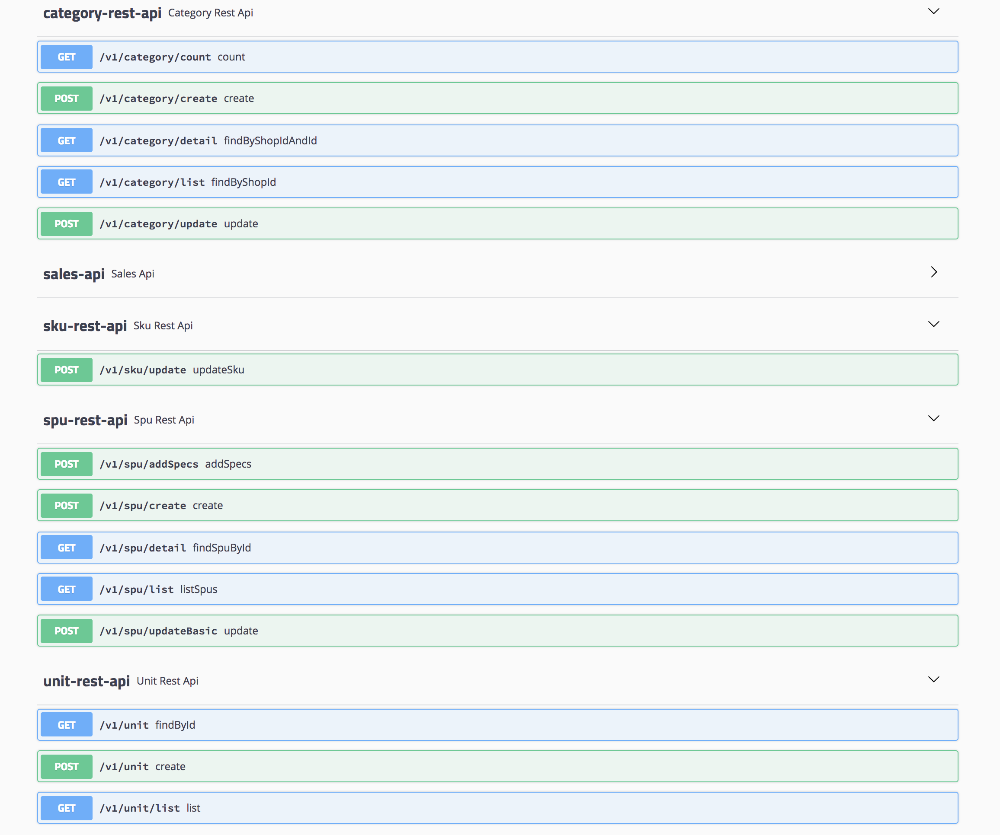
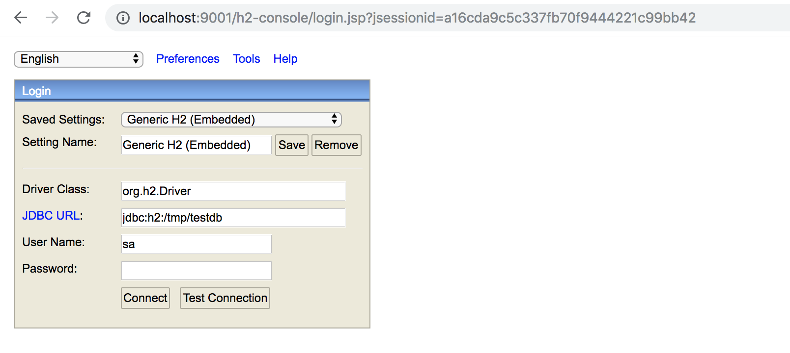
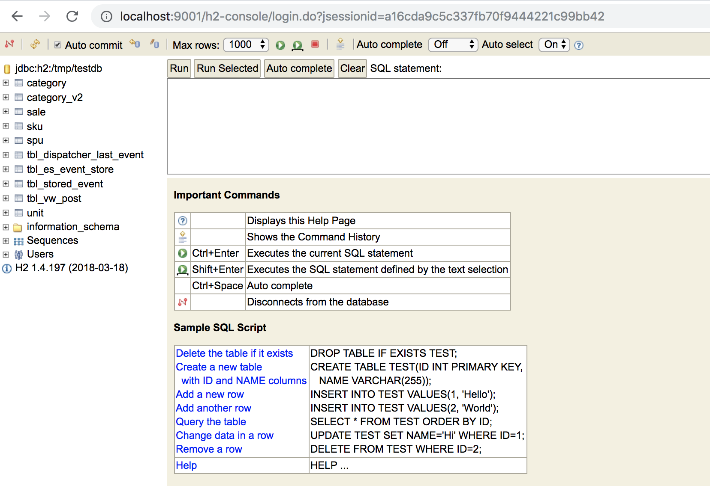

# 商品管理领域DDD示例

## 设计思路

[设计思路](https://www.jianshu.com/p/89dfcd672d43)

## 项目结构

* gate: 对外暴露的服务
    * rest：对外暴露的rest服务
    * dubbo：对外暴露的dubbo服务
    * mq: 消息处理器
* application：应用服务层
* domain：领域层
    * shop: 店铺
    * category: 分类
    * unit: 单位
    * spec: 规格
    * spu: 商品库
    * sales: 上架销售
* infra：基础设施层
    * mq: 发消息实现
    * acl：代理实现
    * repo：仓储实现
    
## 如何使用

1. 下载依赖并进行本地部署

```
git clone https://github.com/fancyyawn/zhacker-framework.git
mvn clean install -Dmaven.test.skip
```

2. 下载本项目并在本地启动应用

``` 
git clone https://github.com/fancyyawn/zhack-sample-ddd-spu.git
mvn spring-boot:run
```

3. 通过swagger界面操作接口 [swagger-ui](http://localhost:9001/swagger-ui.html)



4. 通过h2-console查看数据 [h2-console](http://localhost:9001/h2-console)

* 地址：jdbc:h2:/tmp/testdb
* 用户名：sa
* 密码：为空



